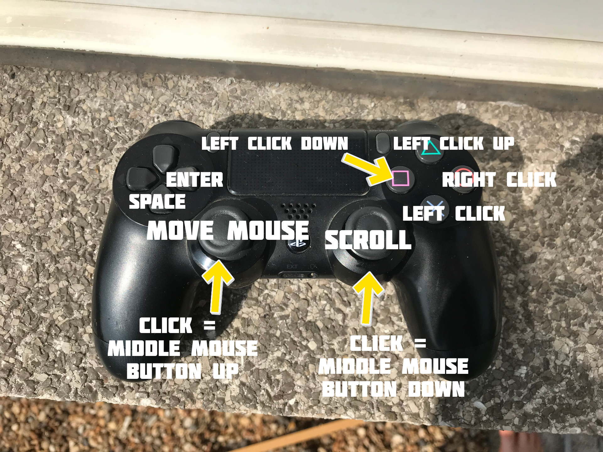

<h1>Controller Mouse</h1>
<h2>
What is controller mouse?</h2>

Controller Mouse is a project made in rust that allows you to control your mouse with a dualshock4 playstation controller.

<h2>Controls</h2>

<h2>Get started!</h2>

First off <a href = "https://github.com/MakingStan/Controller_Mouse/releases/tag/new">download the controller</a> mouse program for your desired operating system.
 
 
Connect your dualshock controller and
try to run the program with the intial pid (product id) and vid(vendor id), These id's are used to identify your controller.
 
 
If it does not work you'll have to download the <a href = "https://github.com/MakingStan/Controller_Mouse_Config/releases/tag/new">controller_mouse_config</a> program. This program will make you able to adjust the sensivity and the pid & vid

<h2>How to get your pid & vid</h2>
<h3>Windows</h3>
<li>Go to Control Panel > Device Manager and find your controller USB device.</li>
<li>Double click the device or right click and select Properties.</li>
<li>Go to the Details tab and select Hardware ID to view its PID and VID.</li>

<h3>Mac</h3>
<li>Connect your dualshock controller.</li>
<li>Go to About this Mac > Overview > System Report.</li>
<li>Under Hardware, select USB.</li>
<li>Find your controller device and select it to view its PID and VID.</li>

<h3>Linux</h3>
<li>Connect your dualshock controller.</li>
<li>Go into your terminal and type in "lusb"</li>
<li>Find your dualshock controller and copy the PID and VID</li>